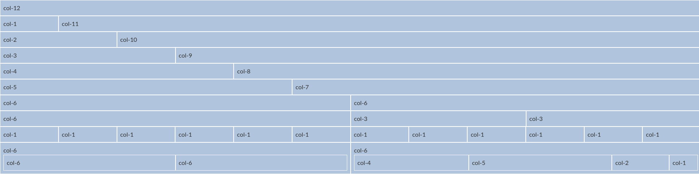

# Simplest Grid
Simple, lightweight 12-column CSS grid. Based on Zach Cole's [Simple Grid](https://github.com/zachacole/Simple-Grid). 



## Example
```html
<div class="container">
  <!-- The container will take up 100% of its parent's width -->
  <div class="row">
    <!-- Each row will take up 100% of its container's width -->
    <div class="col-3">
      <!-- col-3 will take up 3/12 of its row -->
    </div>
    <div class="col-3">
      <!-- col-3 will take up 3/12 of its row -->
    </div>
    <div class="col-6">
      <!-- col-6 will take up 6/12 of its row -->
    </div>
  </div>
</div>
```

## License
MIT License
